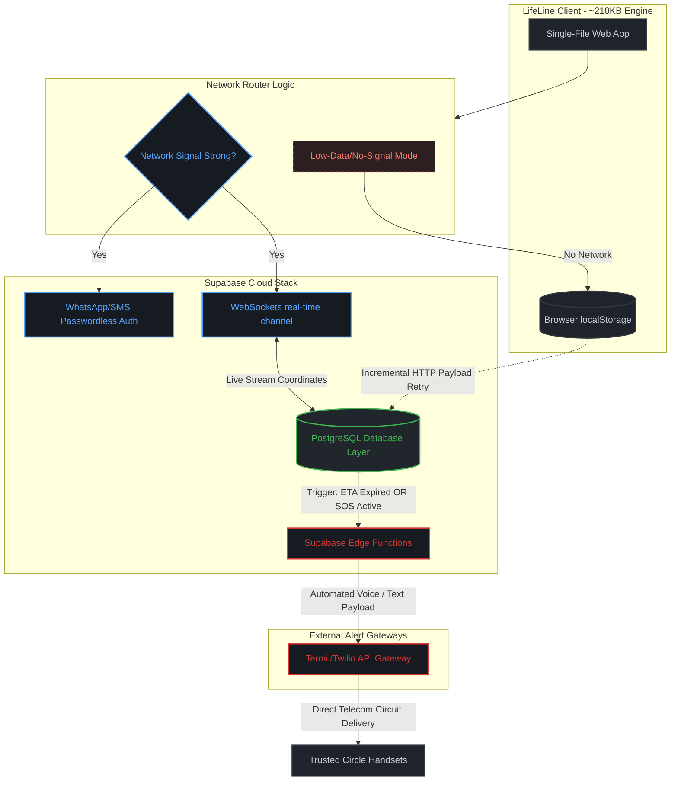

# LifeLine 🛡️

> Tell your circle you made it home safely — before they have to ask.

A personal-safety check-in app built for Nigerian mobile networks. Prevention-first design: the daily safe-arrival habit is what makes the SOS work when it matters.

**TS Academy · Phoenix Cohort · Group 39 · Capstone · May 2026**

---

## 🔗 Project Links

*   **📱 Live App:** [anthonyosakwe.github.io/lifeline/lifelineapp/](https://github.io)
*   **📐 Wireframes (lo-fi):** [anthonyosakwe.github.io/lifeline/wireframes/](https://github.io)
*   **📁 Supporting Documents (PRD, Research, Design):** [Google Drive Folder](https://google.com)
*   **📄 Build Documentation:** [lifeline-build-docs](https://github.io)

---

## 🎯 The Problem

Nigerians — especially women, professionals working late, and students — face daily safety friction. There's no fast, low-friction way to tell trusted contacts *"I'm on my way home"* or *"I need help"* without unlocking your phone, finding the right person, and typing. Existing options (WhatsApp share-location, calling a friend) are slow, social, and don't scale to emergencies.

*   **Target User:** Ada, 28, project manager in Lagos. Takes Bolt rides home after late meetings. Has two trusted contacts (sister + close friend).

---

## 🚀 Demo Cheatsheet (For Judges)

Open the **[Live App](https://github.io)** on a phone, then execute these flows:

1.  **Tap Get Started:** Walk through the onboarding sequence.
2.  **OTP Code:** Use `8484` (any other code triggers the failure path).
3.  **Home Screen:** Hold the red **SOS** button for 3 seconds → emergency activates.
4.  **Start Safe Arrival Card:** Tap **Allow** on the GPS banner → real OpenStreetMap loads with your live location.
5.  **Bottom Demo Nav:** Jump instantly between preview flows: `🔑 Onboard` · `🏠 Safe Arrival` · `🚨 SOS` · `⚠️ Failures`.

*   **Three failure paths to demo:** wrong OTP code · location permission denied · trip ETA overdue.
*   **Two delighters:** confetti on safe arrival · shake-to-SOS hint.

---

## 🛠️ Tech Highlights

*   **Single-file HTML App (~210 KB):** Highly compact and deployable to any static host environment.
*   **Real OpenStreetMap via Leaflet:** Embedded completely inline with **zero CDN dependencies**.
*   **Built for Poor Networks:** Self-hosted mapping libraries, progressive tile loading, and error fallbacks for failed tiles.
*   **Native Telemetry API Integration:** Uses `navigator.geolocation` for position maps, `navigator.vibrate` for tactile Android SOS feedback, and DeviceMotion API for shake detection.
*   **No Build Steps:** Vanilla JS execution with zero backend dependencies in the current V1 prototype phase.

---

## 🏗️ System Architecture (V2 Backend Migration)

This system model maps how our engineering transition scales into database and cloud layers while strictly preserving our low-bandwidth performance rules:

---

## 📅 2-Year Strategic Product Roadmap

### Year 1: Infrastructure Foundations & Verification
*   **Year 1 - Q1:** Deploy data schemas to Supabase Postgres; configure passwordless WhatsApp auth triggers; establish background sync fallback scripts.
*   **Year 1 - Q2:** Run closed beta trials across core Lagos transport hubs; build a read-only tracking view for contacts; bundle map assets into local cache layers.
*   **Year 1 - Q3:** Hook up local service APIs (Termii) for failover SMS alerts; launch Edge Functions for automated alert loops; introduce USSD safety triggers.
*   **Year 1 - Q4:** Deploy public web access layers; implement crowd-sourced landmark checkpoints; introduce dynamic background GPS power throttling.

### Year 2: Scale, Integrations & Systems Growth
*   **Year 2 - Q1:** Open developer API portals for ride-hailing app integrations; connect communication arrays to emergency health dispatchers; anonymize network safety telemetry to map municipal risk trends.

---

## 👥 Group 39

Built with ☕ + ⚡ over 4 weeks. 

*If you have access issues with the Google Drive folder, contact the team — link sharing is set to "Anyone with the link · Viewer."*
