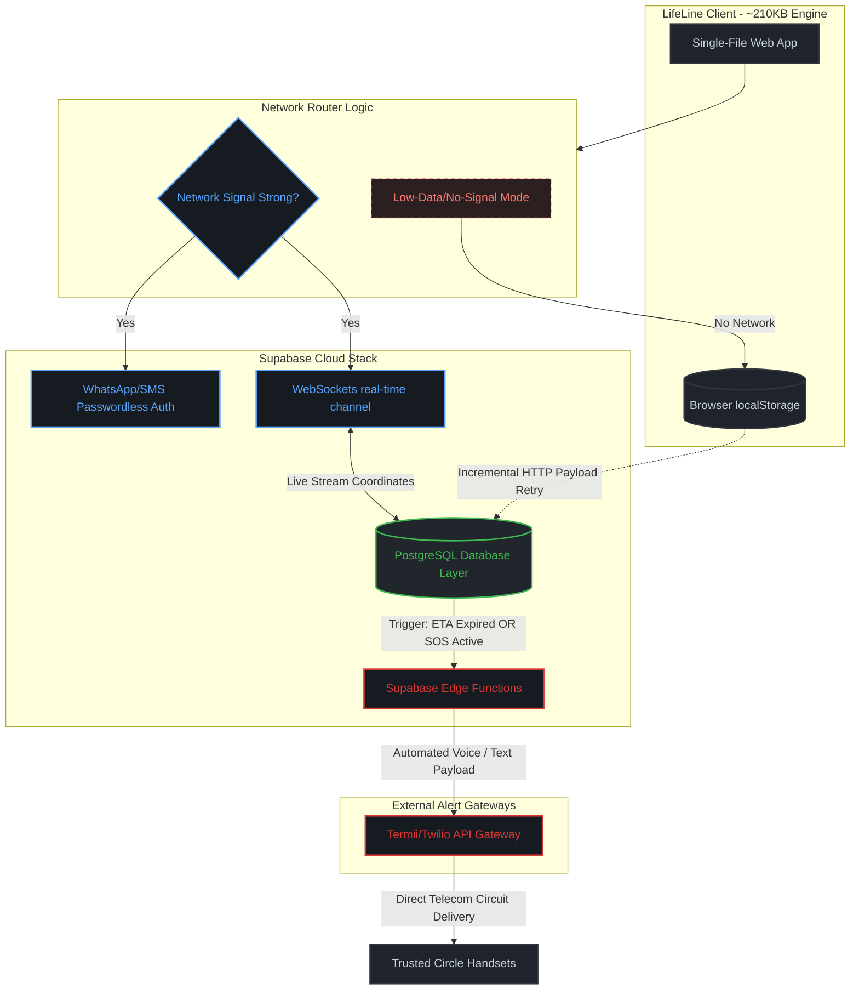

# LifeLine

> Tell your circle you made it home safely — before they have to ask.

A personal-safety check-in app built for Nigerian mobile networks. Prevention-first design: the daily safe-arrival habit is what makes the SOS work when it matters.

**TS Academy · Phoenix Cohort · Group 39 · Capstone · May 2026**

---

## 🔗 Other Documents links

*   **📱 Weekly Updates:** [tsa-phoenix-safetytech-39.github.io/lifeline/lifeline-weekly-updates/](/lifeline-weekly-updates/)
*   **📐 Wireframes (lo-fi):** [tsa-phoenix-safetytech-39.github.io/lifeline/wireframes/](/wireframes/index.html)
*   **📁 Supporting Documents (PRD, Research, Design):** [Google Drive Folder](https://drive.google.com/drive/folders/1-Brs6CcKtow2uwkJsMumYC0nG7bJPqE1)
*   **📄 Build Documentation:** [lifeline-build-docs](/lifeline-build-docs/index.html)

---

## 🎯 The Problem

Nigerians — especially women, professionals working late, and students — face daily safety friction. There's no fast, low-friction way to tell trusted contacts *"I'm on my way home"* or *"I need help"* without unlocking your phone, finding the right person, and typing. Existing options (WhatsApp share-location, calling a friend) are slow, social, and don't scale to emergencies.

*   **Target User:** Ada Umeh, 20, 300-level Biochemistry, University of Nigeria, Nsukka (UNN). Walks back to her hostel after late library sessions. Has trusted contacts configured (mum + boyfriend).

---

## 🚀 Demo Cheatsheet (For Judges)

Open the **[Live App](https://github.io)** on a phone, then execute these flows:

1.  **Tap Get Started:** Walk through the onboarding sequence.
2.  **OTP Code:** Use `8484` (any other code triggers the failure path).
3.  **Home Screen:** Hold the red **SOS** button for 3 seconds → emergency activates.
4.  **Start Safe Arrival Card:** Tap **Allow** on the GPS banner → real OpenStreetMap loads with your live location.
5.  **Bottom Demo Nav:** Jump instantly between preview flows: `🔑 Onboard` · `🏠 Safe Arrival` · `🚨 SOS` · `⚠️ Failures`.

*   **Three failure paths to demo:** wrong OTP code · location permission denied · trip ETA overdue.
*   **Two delighters:** confetti on safe arrival · shake-to-SOS hint.

---

## 🛠️ Tech Highlights

*   **Single-file HTML App (~210 KB):** Highly compact and deployable to any static host environment.
*   **Real OpenStreetMap via Leaflet:** Embedded completely inline with **zero CDN dependencies**.
*   **Built for Poor Networks:** Self-hosted mapping libraries, progressive tile loading, and error fallbacks for failed tiles.
*   **Native Telemetry API Integration:** Uses `navigator.geolocation` for position maps, `navigator.vibrate` for tactile Android SOS feedback, and DeviceMotion API for shake detection.
*   **No Build Steps:** Vanilla JS execution with zero backend dependencies in the current V1 prototype phase.

---

## 🏗️ System Architecture (V2 Backend Migration)

This system model maps how our engineering transition scales into database and cloud layers while strictly preserving our low-bandwidth performance rules:

---

## 🧠 Architecture Deep Dive

LifeLine is designed using an **offline-first, prevention-first safety architecture** optimized for **low-bandwidth Nigerian mobile environments**.

Unlike traditional emergency systems that activate only during crisis moments, LifeLine prioritizes **daily safe-arrival rituals** to normalize trusted-contact communication before emergencies occur.

The architecture follows a **graceful degradation model**:

- Strong network → Real-time synchronization
- Weak network → Delayed sync + lightweight payloads
- No signal → Offline persistence + automatic retry

This ensures the app remains useful even under unstable telecom conditions.

---

## ⚙️ System Design Principles

### 1. Offline-First Reliability
Many Nigerian users experience unstable mobile data, weak signal areas, and intermittent internet access.

Instead of failing when connectivity drops, LifeLine temporarily stores trip states locally and retries transmission when signal quality improves.

**Why this matters**
- Safety tools should not fail silently
- Emergency workflows must tolerate poor connectivity
- Users should still trigger actions with minimal friction

---

### 2. Prevention-First Safety Model

LifeLine is intentionally not just an SOS app.

The product philosophy is:

> “The daily safe-arrival habit is what makes emergency response trusted when it matters.”

By encouraging users to routinely notify trusted contacts that they arrived safely, LifeLine builds behavioral familiarity before emergencies happen.

This increases:
- Trust
- Response speed
- Contact readiness
- User retention

---

## 🖥️ Frontend Layer

The frontend uses a **single-file HTML architecture (~210 KB)** to maximize portability and deployment simplicity.

### Why a Single-File Architecture?

The decision was intentional:

**Benefits**
- Zero installation required
- Deployable to any static host
- Extremely lightweight
- Faster loading on poor networks
- Minimal infrastructure complexity

### Core Client Responsibilities
The client handles:

- Safe-arrival trip initiation
- ETA countdown logic
- GPS permission handling
- SOS trigger activation
- Local offline storage
- Shake detection
- Vibration feedback
- Failure-state recovery

### Native Device APIs Used

| API | Purpose |
|------|---------|
| `navigator.geolocation` | Live user location |
| `navigator.vibrate()` | Emergency haptic feedback |
| `DeviceMotion API` | Shake-to-SOS detection |
| `localStorage` | Offline persistence |

---

## 🌐 Connectivity Decision Engine

LifeLine dynamically changes behavior depending on signal quality.

### Strong Network Path
When connectivity is available:

1. User location syncs in near real-time
2. ETA updates stream to backend services
3. Trusted contact tracking remains active
4. Emergency escalation happens instantly

### Weak/No Signal Path
When signal quality deteriorates:

1. Trip data stores locally
2. Retry queue activates
3. Lightweight sync attempts occur incrementally
4. Emergency state persists until connection returns

This reduces total failure risk in poor coverage zones.

---

## ☁️ Backend Architecture (V2 Migration)

LifeLine V2 transitions from a frontend-only prototype into a cloud-assisted architecture powered by **Supabase**.

### Why Supabase?

Supabase was selected because it provides:

- Authentication
- Real-time database updates
- Edge Functions
- PostgreSQL reliability
- Low infrastructure overhead

without requiring a heavy DevOps setup.

### Backend Components

#### Authentication Layer
Passwordless authentication using:

- WhatsApp OTP
- SMS verification

This minimizes onboarding friction and avoids password fatigue.

#### PostgreSQL Database Layer
Stores:

- User profiles
- Trusted contacts
- Trip sessions
- ETA states
- Emergency logs
- Location snapshots

#### Realtime Engine
WebSocket channels stream trip status updates to trusted contacts.

Examples:
- “Started trip”
- “Running late”
- “Arrived safely”
- “SOS triggered”

#### Edge Functions
Automated backend logic handles:

- Expired ETA timers
- Missed check-ins
- SOS escalation
- Alert routing

without waiting for manual user intervention.

---

## 📡 Alert Escalation Layer

If a user becomes overdue or activates SOS:

### Step 1
Backend detects risk event.

### Step 2
Edge Function evaluates escalation rules.

### Step 3
Alert payload generates automatically.

### Step 4
SMS/WhatsApp provider dispatches message to trusted contacts.

Potential providers:

- Termii (Nigeria-first SMS)
- Twilio (global redundancy)

This creates a telecom failover layer for reliability.

---

## 🔒 Privacy & Safety Considerations

LifeLine minimizes unnecessary surveillance.

The system philosophy is:

**“Safety without over-tracking.”**

Location is used only for:
- Active trip monitoring
- ETA validation
- Emergency escalation

Rather than persistent background surveillance.

User trust remains a core design requirement.

---

## 📈 Scalability Strategy

The architecture is intentionally modular.

### V1
Frontend-only prototype

### V2
Supabase + telecom integrations

### V3
Emergency ecosystem integrations

Potential future integrations:

- Ride-hailing APIs
- Emergency medical dispatch
- Campus security systems
- Municipal emergency services
- Smart geofenced danger zones

This architecture allows LifeLine to scale incrementally without rebuilding the core product.

---

## 📅 2-Year Strategic Product Roadmap

### Year 1: Infrastructure Foundations & Verification
*   **Year 1 - Q1:** Deploy data schemas to Supabase Postgres; configure passwordless WhatsApp auth triggers; establish background sync fallback scripts.
*   **Year 1 - Q2:** Run closed beta trials across UNN and Lagos university campuses; build a read-only tracking view for contacts; bundle map assets into local cache layers.
*   **Year 1 - Q3:** Hook up local service APIs (Termii) for failover SMS alerts; launch Edge Functions for automated alert loops; introduce USSD safety triggers.
*   **Year 1 - Q4:** Deploy public web access layers; implement crowd-sourced landmark checkpoints; introduce dynamic background GPS power throttling.

### Year 2: Scale, Integrations & Systems Growth
*   **Year 2 - Q1:** Open developer API portals for ride-hailing app integrations; connect communication arrays to emergency health dispatchers; anonymize network safety telemetry to map municipal risk trends.

---

## 👥 Group 39

Built with ☕ + ⚡ over 4 weeks. 

*If you have access issues with the Google Drive folder, contact the team — link sharing is set to "Anyone with the link · Viewer."*
